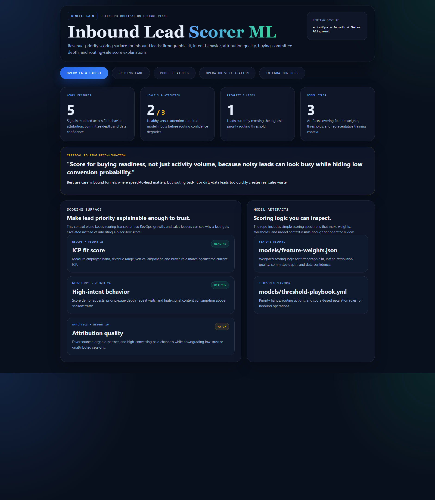
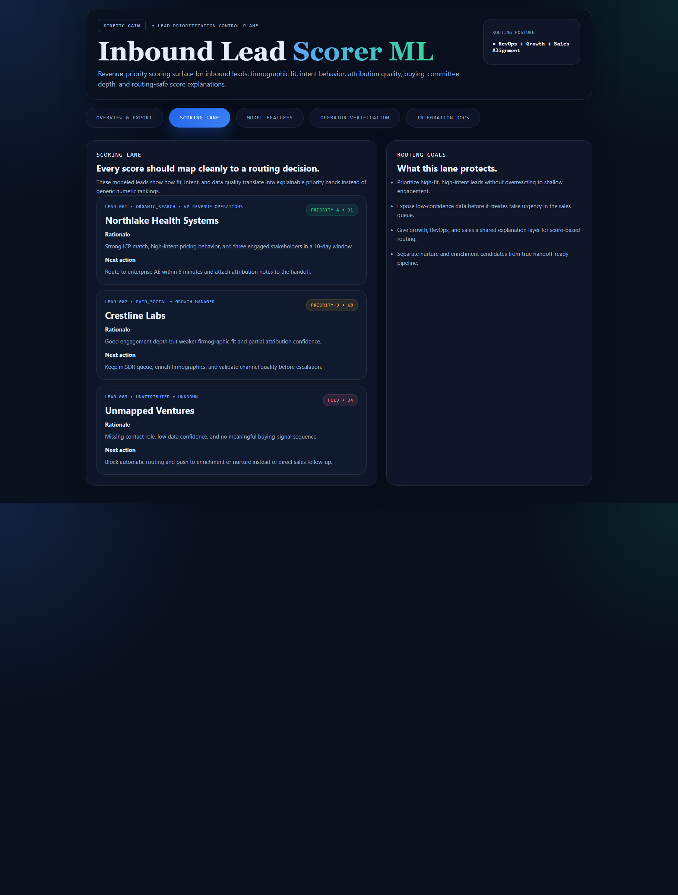
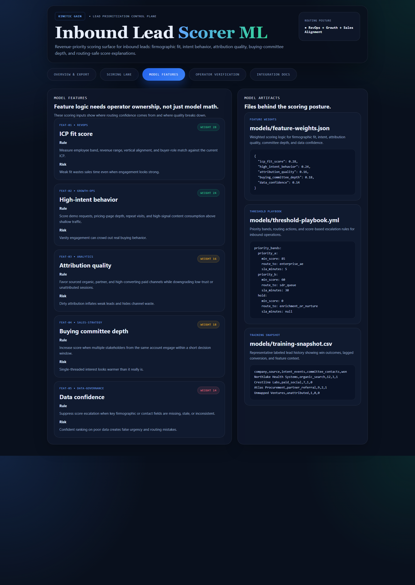

# inbound-lead-scorer-ml

Revenue-priority scoring control plane for inbound leads: firmographic fit, intent behavior, attribution quality, buying-committee depth, and routing-safe score explanations.

## What it shows

- weighted scoring inputs across fit, behavior, attribution, committee depth, and data confidence
- modeled lead-ranking decisions with explainable priority bands
- concrete model artifacts for feature weights, thresholds, and training context
- operator verification for score-based routing trust

## Screenshots

### Overview



### Scoring Lane



### Model Features



## Routes

- `/`
- `/scoring-lane`
- `/model-features`
- `/verification`
- `/docs`

## API

- `/api/dashboard/summary`
- `/api/scoring-lane`
- `/api/model-features`
- `/api/model-artifacts`
- `/api/verification`
- `/api/sample`

## Local development

```powershell
cd inbound-lead-scorer-ml
npm install
npm run dev
```

Then open:

- `http://127.0.0.1:5428/`
- `http://127.0.0.1:5428/scoring-lane`
- `http://127.0.0.1:5428/model-features`
- `http://127.0.0.1:5428/verification`
- `http://127.0.0.1:5428/docs`

## Validation

```powershell
npm run verify
npm run render:assets
```

## Documentation

- [docs/architecture.md](./docs/architecture.md)
- [docs/ORIGIN.md](./docs/ORIGIN.md)
